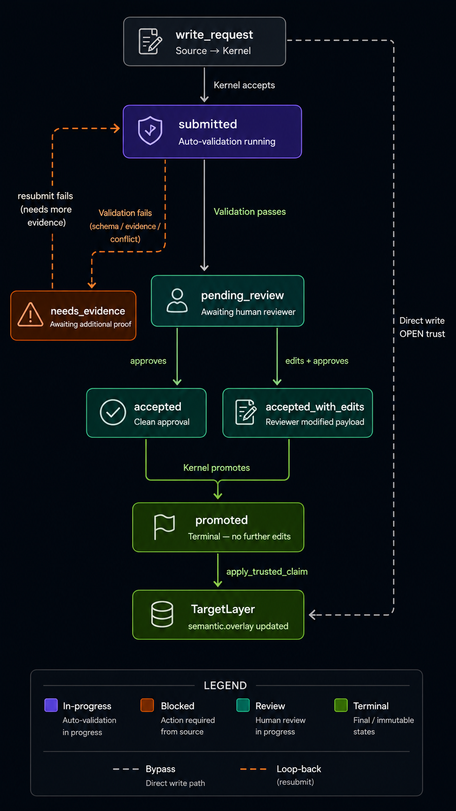

# The trust pipeline

The trust pipeline governs how claims become trusted repository knowledge. Every layer declares who may write directly, who must propose changes for review, and which sources are forbidden. The kernel enforces that policy at write time.

This is the mechanism that lets Graph Harness compound over time without silently accepting unreviewed claims from agents, importers, drift detectors, or humans who are not allowed to write directly under the declared policy.

## Layer trust policy

Trust is declared per layer in the layer manifest. A typical policy separates direct writes from reviewed proposals:

```yaml
trust:
  direct_writes_from:
    - extractor:tree_sitter
    - extractor:lsp_adapter
    - kernel_replay
  review_required_from:
    - agent
    - user
    - importer:foreign_overlay
    - drift_detector
  forbidden_from: []
```

The policy is evaluated before a write enters the target layer. If the source is allowed to write directly, the event is committed. If the source requires review, the write is converted into a proposal in `review.queue`. If the source is forbidden, the write is rejected.

This keeps trust boundaries explicit. Extractor output, authored overlay content, imported rules, and agent-generated suggestions do not become equivalent just because they share a storage path.

## Proposals

A proposal is a structured request to promote a claim into a layer. Examples include:

- An agent-proposed invariant.
- A human-authored harness update.
- A Semgrep importer proposing a rule-backed control.
- A drift detector proposing a selector anchor update.
- A CI bot proposing a generated policy change.

All proposals pass through the same lifecycle. The source affects policy, evidence requirements, and promotion mode; it does not create a separate review system.

## Promotion modes

Layers can define how accepted proposals are promoted.

| Mode | Behavior | Typical use |
|---|---|---|
| `human_only` | Human approval is required before promotion | Conservative default for new or high-risk layers |
| `policy_only` | Kernel promotes when declared policy conditions are met | Mechanical updates with strong evidence, such as high-confidence drift repairs |
| `hybrid` | Some proposals auto-promote by policy; others require review | Practical default for semantic overlay content |

Promotion policy is itself reviewable content. A system that can auto-accept anchor updates must also make the threshold, evidence requirements, and audit trail inspectable.

## Proposal lifecycle

The lifecycle records every transition as a kernel event.



| State | Meaning |
|---|---|
| `submitted` | A source attempted a write that requires review. |
| `pending_review` | The proposal passed auto-validation and is ready for policy or human review. |
| `needs_evidence` | Required evidence, selector resolution, or schema validity is incomplete. |
| `deferred` | Review is intentionally postponed until another trigger, owner, or dependency is available. |
| `rejected` | The proposal was declined with a recorded reason. |
| `accepted` | The proposal was accepted as submitted. |
| `accepted_with_edits` | The proposal was accepted after reviewer edits or conflict resolution. |
| `promoted` | The accepted content was applied to the trusted layer. |
| `superseded` | Later trusted content replaced this promoted version. |

Not every proposal visits every state. A proposal may be rejected after review, accepted with edits, deferred until another change lands, or promoted automatically under policy. Later proposals can supersede promoted content while preserving the original audit trail.

The important property is that review state is part of the graph. Review history, conflict decisions, evidence, and promotion events are queryable like other layer facts.

## Auto-validation

Before a proposal reaches normal review, the kernel performs structural validation. This prevents low-quality or malformed proposals from consuming reviewer attention.

Auto-validation can include:

- Parsing and schema validation.
- Selector resolution and cardinality checks.
- Evidence requirement checks for the proposal kind.
- Conflict detection against pending or recently accepted proposals.
- Freshness and provenance checks for claims derived from graph state.

Failures produce structured feedback. A proposal can move to `needs_evidence` with a precise gap report instead of becoming an ambiguous review comment.

## Evidence requirements

Evidence requirements are declared by proposal kind. An invariant proposal may require a target selector and a test, pattern, or historical example. A flow proposal may require an entry symbol and at least one step. An anchor update may require a drift signal and a candidate match above a confidence threshold.

Evidence serves two purposes. It improves reviewer throughput, and it limits low-confidence automation. An agent can propose a rule, but the proposal must carry enough evidence to be reviewed. A drift detector can propose an anchor update, but promotion depends on confidence and policy.

## Conflict resolution

Conflicts are first-class events. When two proposals overlap, the kernel records the conflict and exposes it to review tools.

Common resolution actions include:

- `merge_proposals`: produce a combined proposal and accept both source proposals with edits.
- `reject_in_favor_of`: reject one proposal while preserving the decision and rationale.
- `escalate`: route the conflict to a higher review tier or policy owner.

Conflict state remains queryable. This is important for teams operating at scale, where multiple agents, importers, and humans may propose changes to the same overlay region.

## Compounding knowledge

The trust pipeline is how repository knowledge becomes durable. A drift detector may notice that a selector's primary anchor no longer resolves after a rename. If fallback anchors identify the new entity with high confidence, the detector can propose an anchor update. Depending on policy, the update may auto-promote or require human review. Once accepted, the harness is updated and future operations attach the corrected context.

The same pattern applies to agent suggestions, imported rule packs, and human-authored refinements. Nothing is silently absorbed into the trusted overlay. Promoted knowledge has source, evidence, review state, and sequence history.

## Relationship to the layered graph

The trust pipeline is implemented as its own layer, `review.queue`, but it governs writes across all layers. `semantic.overlay` is the most visible consumer because harnesses, selectors, controls, and rules are authored there. The same mechanism also applies to future layers such as ownership, security, build, or runtime traces.

By making trust policy declarative and review state durable, Graph Harness avoids the common failure mode where useful automation gradually becomes an unreviewed source of project truth.
